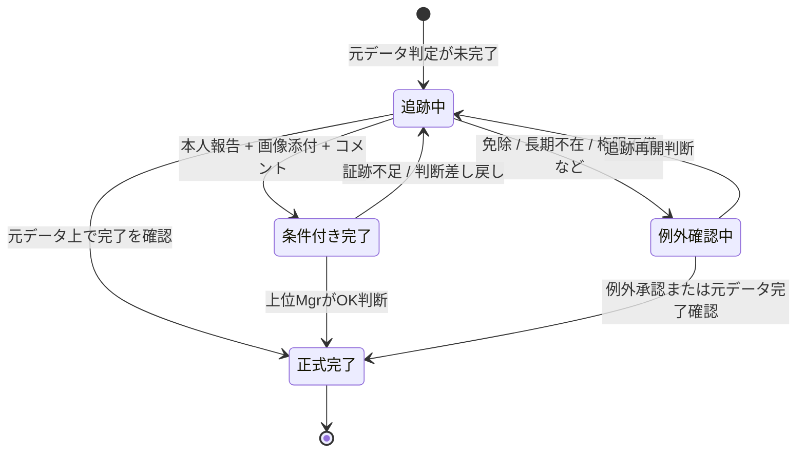

# +Story Platform 活用 要求整理メモ

## 1. この文書の目的

この文書は、ユーザーから提示された初期要望を、今後の議論と設計の土台になる形で整理するための叩き台です。

現時点では、仕様を確定することではなく、次の 3 点を明確にすることを目的とします。

| 観点 | 明確にしたいこと |
| --- | --- |
| 目的 | 何を改善したいのか |
| 制約 | 何が見えて、何が見えてはいけないのか |
| 論点 | 次に何を決めないと前に進めないのか |

---

## 2. 背景認識

- 社内には `+Story platform` という受講履歴管理基盤があり、全社員のさまざまな学習履歴が蓄積されている。
- 利用可能な入力データは、`+Story platform` から抽出された CSV データである。
- 実現したいことは大きく 2 系統ある。

| 大分類 | 内容 |
| --- | --- |
| 運用最適化 | 周知教育など、強制力の伴う教育の受講率を 100% まで自動追跡したい |
| データ活用 | 学習データを、キャリア支援・スキル育成・外部講座 ROI 改善に活かしたい |

---

## 3. 解きたい課題

### 3.1 強制受講の追跡運用に関する課題

- 現状は、上司や部門管理者が受講進捗の追跡責任を負っている。
- 閲覧権限の制約により、見える人が限られるため、追跡が属人的になりやすい。
- 現場では「誰がどこまで受講済みか」を即座に把握しにくく、都度の声掛けや確認が心理的負担になっている。
- 納期付きの教育は、未受講者を漏れなく追う運用が必要である。

### 3.2 キャリア・スキル支援に関する課題

- 外部学習サービスにコストを投じている一方で、受講が十分に進んでいない可能性がある。
- 学習内容と実業務・本人のキャリア志向が乖離している可能性がある。
- 学習データを蓄積しているが、個人支援や組織的な育成判断に十分活用できていない。

### 3.3 いま深掘りすべき課題の本質

現時点では、表面的には「受講履歴を見える化したい」という要求に見えるが、本質的には次の 3 種類の問題が混在している。

| 問題の種類 | 本質 | 典型的な症状 |
| --- | --- | --- |
| 運用の問題 | 追跡責任が人に依存している | 声掛け漏れ、確認の手間、属人化 |
| 情報設計の問題 | 見えるべき人と見えてはいけない情報の境界が曖昧 | 見せられないから追えない、追うために限定共有が増える |
| 価値設計の問題 | 学習データが蓄積されても意思決定に変換されていない | 外部講座の利用低迷、キャリア支援への未活用 |

したがって、今後の議論では「どんな機能がほしいか」よりも先に、「現状のどの運用負荷を、誰から、どう減らしたいのか」を明文化する必要がある。

---

## 4. ステークホルダー別のペイン仮説

現時点では、少なくとも次のステークホルダーごとに痛みが異なると考えられる。

| ステークホルダー | 主な責任 / 立場 | ペイン仮説 |
| --- | --- | --- |
| 受講者本人 | 指定された学習を受ける、任意学習を活用する | 何を優先して受けるべきか分かりにくい。任意学習が業務やキャリアと結び付きにくい |
| 直属上司 | 部下の受講状況管理、育成支援 | 未受講フォローが負担。必要な情報だけ安全に見たい |
| 部門管理者 / 研修管理者 | 部門内の完了状況統制 | 追跡責任が重い。集計や督促が手作業で、抜け漏れリスクが高い |
| 人事 / 育成部門 | 制度設計、教育投資判断 | 受講データはあるが、施策評価や ROI 判断につながりにくい |
| 経営 / 監査対応者 | 全社コンプライアンス、投資効果確認 | 必須教育の完了担保と説明責任が必要 |

### 4.1 強制受講側のペイン

この領域の一次利用者は、現時点では `部門管理者` と置く。

| ペイン | なぜ発生するか | 解けると何が改善するか |
| --- | --- | --- |
| 誰を追えばよいか分からない | 対象者判定と閲覧権限が分散している | 追跡対象の明確化 |
| 進捗確認が重い | 一覧化や優先度付けが弱い | 督促工数の削減 |
| 声掛けが心理的負担になる | 現場が事実を確信できないまま催促している | 管理負荷と摩擦の低減 |
| 納期直前に問題が顕在化する | 途中での検知・通知が弱い | 期限内完了率の改善 |

特に重い手作業は、`確認` と `追跡` である。

したがって、強制受講領域の第一目的は、単なる未受講者一覧の可視化ではなく、`部門管理者が安心して追跡できる状態を作り、心理負荷を下げること` と定義できる。

ここでいう心理負荷は、単なる作業量の多さだけではない。特に次のような瞬間に強く発生すると考えられる。

| 心理負荷が発生する瞬間 | 背景 |
| --- | --- |
| 上位層から進捗説明を求められるとき | 100% 未達の場合、未達理由を考え、説明しなければならないため |
| 未受講者が残る理由を整理するとき | 単純な未完了一覧ではなく、なぜ完了していないかの文脈整理が必要なため |
| 多段の組織階層へ追跡指示を流すとき | 部下の部下の部下のような階層に対し、管理者経由で追跡しなければならないため |
| 指示を出す / 受けるやり取りが続くとき | 督促行為そのものが対人緊張を伴うため |

つまり、部門管理者にとっての本質的な痛みは、`未受講者がいること` そのものだけではなく、`未達状態を上にも下にも説明しながら追跡責任を負い続けること` にある。

### 4.2 キャリア支援側のペイン

この領域の一次利用者は、現時点では `人事部` と置く。

| ペイン | なぜ発生するか | 解けると何が改善するか |
| --- | --- | --- |
| 学びと仕事がつながらない | 学習履歴が職務・役割・志向と接続されていない | 受講意義の納得感向上 |
| 外部講座が使われない | 何を選べばよいか分からず、利用文脈も弱い | 利用率、継続率、投資対効果の改善 |
| 学習データが施策改善に使えない | 分析観点が未定義で、評価指標も曖昧 | 育成施策の意思決定精度向上 |

特に重い手作業は、`集計 / 可視化` と、その結果を踏まえた `次の意思決定` である。

したがって、キャリア支援領域の第一目的は、個人への推薦機能を急ぐことではなく、`人事部が教育投資の効果を説明し、次の施策判断を行える状態を作ること` と定義できる。

---

## 5. この企画で避けるべき失敗

要件定義の段階で、先に次の失敗を避けるべきである。

| 失敗パターン | なぜ危険か |
| --- | --- |
| ダッシュボードを作っただけで終わる | 誰の業務をどう軽くするかが不明だと使われないため |
| すべての学習データを同じ粒度で扱う | 区分ごとに機密性と目的が違うため |
| キャリア支援を早期に評価や査定に接続する | プライバシーと納得感の論点が急激に重くなるため |
| 現場の負荷削減よりも分析の見栄えを優先する | 初期導入価値が伝わらず、継続利用されないため |

---

## 6. 現時点での問題定義

今回の企画で最初に定義すべき問題は、次のように整理できる。

### 6.1 問題定義A: 強制受講の運用負荷

`限られた閲覧権限の中で、責任者が納期付き教育の未受講者を漏れなく追跡しなければならず、そのオペレーションが属人的かつ高負荷になっている。`

補足すると、この高負荷の中心は単純な作業量だけではなく、`確信を持てない状態で人に働きかけ続ける心理負荷` にある。

さらに言えば、その心理負荷は次の 2 方向から生じる。

- 上方向: 上位層から、なぜ 100% でないのかを問われ、説明責任を負う
- 下方向: 多段の組織構造の中で、管理者経由の追跡指示を出し続ける必要がある

したがって、強制受講ドメインで解くべき問題は、`未受講者検知` だけでなく、`説明責任を支える根拠整理と追跡導線の整流化` まで含む。

### 6.2 問題定義B: 学習データの価値未転換

`外部教育や任意学習の履歴は蓄積されているが、個人の成長支援や組織の教育投資判断に変換されておらず、利用率と投資対効果の改善余地が大きい。`

補足すると、ここで最初に解くべきなのは受講者個人の体験最適化よりも、`人事部が投資対効果を説明できない状態` である。具体的には「なぜ活用されていないのか」「活用されている組織やテーマはどこか」を把握できていないことが問題である。

この 2 つの問題は関連しているが、短期で解くべき対象と中長期で解くべき対象は分けて扱う必要がある。

---

## 6.3 現時点で確定度の高い要求仮説

ここまでの議論から、現時点で確度が高い要求仮説を整理する。

| 領域 | 一次利用者 | 最も重い負荷 | 最初に改善したい成果 |
| --- | --- | --- | --- |
| 強制受講 | 部門管理者 | 確認、追跡 | 心理負荷の低減 |
| キャリア支援 | 人事部 | 集計 / 可視化、意思決定 | 投資対効果の説明可能性向上 |

この整理により、両者は同じ「学習データ活用」でも、目指すべき成果が異なることがより明確になった。

- 強制受講は、`管理オペレーションの安心感` が主要価値である。
- キャリア支援は、`人事判断の説明可能性` が主要価値である。

### 6.4 ドメイン分離の方針

現時点では、`強制受講` と `キャリア支援` は同一プロダクト内の単なる別機能ではなく、`別ドメインとして分離して設計する` 方針が妥当である。

その主因は、要求されるデータ鮮度が異なるためである。

| 領域 | 主な目的 | 求められるデータ鮮度 | 設計上の含意 |
| --- | --- | --- | --- |
| 強制受講 | 未受講者追跡、期限内完了の担保 | 通常時は日次更新。納期間近は手動更新を前提に、誤差 5-10 分程度の即時性が必要 | 通知、追跡導線、責任分界が重要 |
| キャリア支援 | 活用実態の把握、ROI 説明、次の施策判断 | 月次などの静的取得でも成立しやすい | 分析軸、集計粒度、比較可能性が重要 |

この差は実装都合ではなく、業務要求の差分である。

- 強制受講は、情報の遅延がそのまま追跡不安と心理負荷に直結する。
- キャリア支援は、傾向把握と施策判断が中心であり、一定期間ごとのスナップショットでも価値を出しやすい。

したがって、今後の議論では 2 領域を別ドメインとして扱い、データ取得頻度、閲覧権限、成功指標、ユースケースを混在させないことを前提に進める。

---

## 7. 学習データの分類

| 区分 | 概要 | 対象範囲 | 納期 | 主な機密性 / 閲覧制約 |
| --- | --- | --- | --- | --- |
| 1. 周知教育 | 全社必須のリテラシー・監査対応教育 | 全社または条件該当者 | あり | 基本は業務管理目的。未受講管理が重要 |
| 2. 個人情報と紐づく教育 | 昇進講習など、個人のキャリアや人事情報と強く結びつく教育 | 条件該当者 | あり得る | 直属上司とその上位系譜までに限定されるべき |
| 3. 部門独自の教育 | 部門内で任意または必須化される教育 | 特定組織のみ | 部門判断 | 強制力と公開範囲が部門ごとに異なる |
| 4. 外部の教育 | Udemy、Globis など外部教育プログラム | 全社または利用者 | なし | 閲覧公開の制約は低いが、キャリア情報との関係は強い |
| 5. その他の教育 | 用語集動画や推奨コンテンツなど | 任意 | なし | 強制力が低く、補助的な位置付け |

---

## 8. この企画で扱うべき本質的な論点

今回の話は、単純な「受講管理システム」ではなく、次の 2 つの性質が同居しています。

| 論点 | 内容 |
| --- | --- |
| オペレーション論点 | 納期と責任者が存在する教育を、漏れなく完遂させる仕組みが必要 |
| タレント活用論点 | 個人の成長と組織投資の効果を高めるため、任意学習データを活かしたい |

この 2 つは同じ学習データを使う一方で、成功条件が異なります。

| 項目 | 強制受講の追跡 | キャリア・スキル支援 |
| --- | --- | --- |
| 成功指標 | 期限内完了率、未受講者ゼロ | 利用率、継続率、学習と業務の整合、ROI |
| 主な利用者 | 管理者、上司、部門責任者 | 本人、人事、育成責任者、場合によって上司 |
| 必要な権限制御 | 強い | 非常に強い |
| 設計の難所 | 通知、督促、責任分界 | プライバシー、推薦妥当性、説明可能性 |

したがって、以後の議論では「同じプロダクトの 1 機能群」として扱うのではなく、`運用支援ドメイン` と `人材育成支援ドメイン` を分けて整理したほうが論理的です。

---

## 9. 現時点の仮説

### 9.1 仮説A: MVP は強制受講の追跡に寄せるべき

理由は以下です。

- 課題が具体的で、業務上の痛みが明確である。
- 成果指標が比較的測りやすい。
- CSV からでも開始しやすい。
- 権限制御の要件が厳しいため、ここを先に固めると後続のキャリア支援機能の土台になる。
- 一次利用者と削減したい負荷が、部門管理者の `確認 / 追跡 / 心理負荷` に具体化されている。

### 9.2 仮説B: キャリア支援は分析ユースケースから始めるべき

理由は以下です。

- いきなり推薦や評価活用に進むと、プライバシー・納得感・説明責任で議論が発散しやすい。
- まずは受講傾向、利用率、部門別偏り、外部講座 ROI 仮説といった観察系の分析から入るほうが安全である。
- 一次利用者が人事部であり、最初に必要なのは個人向け体験よりも、投資対効果の説明と次の施策判断である。
- 月次の静的データ取得でも成立しやすく、即時同期前提の追跡設計と切り離して考えられる。

---

## 10. 先に決めるべき事項

### 10.1 データと業務の境界

| 論点 | なぜ先に決める必要があるか |
| --- | --- |
| CSV に含まれる列の実態 | 実現可能な追跡・分析の範囲が変わるため |
| 社員・組織マスタとの突合可否 | 上司系譜や部門責任者へのひも付けに必須なため |
| 受講必須判定ロジックの有無 | そもそも「誰を追うべきか」の判定基盤になるため |
| 更新頻度 | 自動追跡の鮮度と運用設計に直結するため |

### 10.2 権限と公開範囲

| 論点 | なぜ重要か |
| --- | --- |
| 区分 2 の閲覧者定義 | 最重要のセキュリティ制約であるため |
| 区分 3 の部門裁量の範囲 | 部門ごとに見せ方・追い方が変わるため |
| 区分 4 を誰まで公開してよいか | キャリア支援施策の設計前提になるため |
| 本人に何を見せるか | 督促 UX とキャリア支援 UX の分岐点になるため |

#### 10.2.1 権限設計の基本原則

管理権限は、単に「誰が見られるか」だけでなく、`どの範囲を` `どの粒度で` `何の目的で` 扱えるかを分けて設計する必要がある。

現時点では、少なくとも次の原則を固定して進めるのが妥当である。

| 原則 | 内容 |
| --- | --- |
| デフォルト拒否 | 明示的に許可された範囲だけを見せる |
| 対象者基準を優先 | まずは `誰の情報か` と `その人との関係` で閲覧可否を決める |
| 役割と範囲を分離 | ロールだけでなく、本人 / 直属配下 / 自組織 / 上位集計などのスコープで制御する |
| 詳細閲覧と集計閲覧を分離 | 個票を見られる権限と、集計だけ見られる権限は分ける |
| 管理閲覧と公開閲覧を分離 | 管理目的の閲覧と、学びの軌跡を見せる公開は別権限にする |
| 強制受講とキャリア支援を分離 | 同じ人物でも、ドメインごとに見えてよい情報は変わる |
| PFロールをそのまま使わない | `role_code` は運営権限の補助情報であり、本システムの業務権限とは切り分ける |
| 区分単位で公開範囲を変える | 学習データ 1-5 区分で公開条件を変える |
| 自由記述タイトルに依存しない | 研修名から機微性を自動判定しない |
| 機微判定は別管理する | 公開可否に関わる機微区分は、別マスタまたは別フラグで管理する |

特に重要なのは、`未受講者の追跡に必要な情報` と `キャリア支援のために見たい情報` は同じではないという点である。

たとえば、部門管理者が強制受講の未完了状況を追う必要はあっても、区分 2 の詳細な学習履歴まで常時見えてよいとは限らない。

#### 10.2.2 権限設計の前提更新

現時点の要件を素直に整理すると、権限はまず次の 2 種類に分けるべきである。

| 権限種別 | 目的 | 典型例 |
| --- | --- | --- |
| 管理閲覧権限 | Aさんの受講状況を、管理責任のある人だけが見る | 本人、直属上司、部門管理者、組織長、人事 |
| 公開閲覧権限 | 学びの軌跡を、共有・可視化のために見せる | 学習事例共有、社内ナレッジ可視化 |

この分離を置くと、`BさんがAさんの受講内容を勝手に見られるのはまずい` という要件と、`学びの軌跡を可視化したい` という要件を同時に両立しやすくなる。

つまり、通常の個票閲覧は `管理閲覧権限` で厳格に閉じ、学びの軌跡の可視化は `公開閲覧権限` として別ルールにすればよい。

この前提に立つと、管理権限マトリクスはかなり単純になる。

#### 10.2.3 権限設計の軸

管理権限マトリクスは、少なくとも次の 3 軸で持つ必要がある。

| 軸 | 内容 | 例 |
| --- | --- | --- |
| ロール軸 | 誰か | 受講者本人、直属上司、部門管理者、人事、経営 |
| スコープ軸 | どの範囲か | 本人、自組織、配下組織、全社 |
| 表示粒度軸 | どこまで見せるか | 個票詳細、進捗詳細、集計のみ、閲覧不可 |

この 3 軸を混ぜると議論が崩れるため、マトリクスでは `ロール` と `対象区分` と `許可範囲` を明示的に分ける。

ただし、現時点の要件では `対象者との関係` が最優先軸であり、`コンテンツ区分` はその次に効く補助軸として扱うのがよい。

#### 10.2.4 ロール定義の叩き台

現時点では、少なくとも次のロールを区別して考えるのが妥当である。

| ロール | 主な責務 | 備考 |
| --- | --- | --- |
| 受講者本人 | 自分の受講、未完了確認、任意学習活用 | 最も広く本人情報へアクセスできる |
| 直属上司 | 配下社員の必要最小限の進捗把握、育成支援 | 区分 2 は特に慎重に制限する |
| 部門管理者 | 強制受講の追跡、未完了の説明責任 | 個票閲覧は強制受講目的に限定する |
| 組織長 | 上位報告の確認、組織責任の把握 | 原則は集計中心でよい |
| 人事 / 育成部門 | 制度設計、投資対効果分析、対象者管理 | 区分に応じて詳細 / 集計を使い分ける |
| 経営 / 監査対応者 | 全社完了状況、説明責任確認 | 原則は全社集計中心で、個票は例外 |
| システム管理者 | システム保守、障害対応 | 業務上の閲覧権限とは分離して考える |

#### 10.2.5 コンテンツ機微判定に関する前提

ここで大きな制約になるのは、`どのコンテンツが個人情報や人事情報を含みうるかを、現在のデータから機械的に判定できない` ことである。

現時点では、機微性を推測できる材料が `研修名` のような自由記述しかなく、たとえばマネジメント向け研修が `Mgr昇格中` や `Mgr候補` といった機微情報を含みうる場合でも、タイトルだけでは安全に判定できない。

したがって、次の前提を置く必要がある。

1. `研修名の文字列判定` を公開可否の根拠にしない
2. 学習データ 1-5 区分は業務上の分類概念であり、CSV 生データから自動復元できるとは限らない
3. 公開範囲の制御に使うには、別途 `content_visibility_class` のような管理情報が必要である

最低限、コンテンツごとに次のどれかを持つ必要がある。

| 管理情報 | 内容 |
| --- | --- |
| `public` | 通常公開可能。標準マトリクスどおりに扱う |
| `restricted` | 機微性の可能性があり、制限付きで扱う |
| `unknown` | 判定未了。安全側に倒して制限扱いにする |

この前提に立つと、権限マトリクスは `生データに対する権限表` ではなく、`機微区分が付与された後のコンテンツに対する権限表` として読む必要がある。

また、`unknown` の扱いが最重要であり、判定できないものを公開側へ倒す設計は採れない。

したがって、初期フェーズでは次の安全側運用が妥当である。

1. 機微判定未了のコンテンツは、本人と限定管理者以外には詳細非表示にする
2. 強制受講の追跡が必要な場合でも、未分類コンテンツは `要対応教育あり` のような一般化表示を優先する
3. 研修の詳細名称や内容は、分類完了後にのみ通常表示する

#### 10.2.6 管理閲覧マトリクスの確定方針

まずは、`標準許可` を次の 4 段階で表すのがよい。

| 記号 | 意味 |
| --- | --- |
| `D` | 個票詳細まで閲覧可 |
| `P` | 進捗・受講内容など業務上必要な範囲を閲覧可 |
| `A` | 集計のみ閲覧可 |
| `-` | 閲覧不可 |

##### A. 対象者基準の管理閲覧マトリクス

この表は、`Aさんの個票を誰が見られるか` を対象者基準で表す。

現時点では、管理閲覧の標準形は次の表で確定してよい。

| 閲覧者 | Aさんの個票閲覧 |
| --- | --- |
| 受講者本人 | D |
| 直属上司 | P |
| 部門管理者 | P |
| 組織長 | P |
| 人事 / 育成部門 | P |
| 同僚 Bさん | - |
| 他部門の一般社員 | - |
| 経営 / 監査対応者 | A |
| システム管理者 | - |

この形にすると、通常の管理閲覧は `本人 + 管理責任のあるロールだけ` に閉じるため、Bさん問題をかなり明確に防げる。

##### B. 学習データ区分別の補正マトリクス

この表は、`機微判定済みのコンテンツ` に対する標準権限を表す。

機微判定が `unknown` のコンテンツには、そのまま適用せず、安全側の例外ルールを優先する。

| ロール | 区分 1 周知教育 | 区分 2 個人情報連動教育 | 区分 3 部門独自教育 | 区分 4 外部教育 | 区分 5 その他教育 |
| --- | --- | --- | --- | --- | --- |
| 受講者本人 | D | D | D | D | D |
| 直属上司 | P | - | P | A | - |
| 部門管理者 | P | - | P | A | - |
| 組織長 | A | - | A | A | - |
| 人事 / 育成部門 | A | P | A | D | A |
| 経営 / 監査対応者 | A | - | A | A | A |
| システム管理者 | - | - | - | - | - |

この確定方針で特に強く置いている前提は次の通り。

1. 区分 2 は最も厳しく制限し、直属上司や部門管理者でも標準では見せない
2. 強制受講の実務上必要な閲覧は、区分 1 と区分 3 を中心に `P` 権限で与える
3. 外部教育の ROI 分析は人事主導とし、人事には区分 4 の詳細を許可する
4. 経営 / 監査対応者は原則として集計中心とし、個票常時閲覧は許可しない
5. システム管理者は保守権限を持っても、業務データ閲覧権限は自動付与しない
6. 機微判定が `unknown` のコンテンツは、この標準表より厳しい扱いを優先する

つまり、管理閲覧の考え方は次の 2 段で決まる。

1. まず `Aさんを見てよいロールか` を対象者基準で判定する
2. その上で `どこまで見せてよいか` を区分 / 機微判定で補正する

##### C. `P` 権限で閲覧できる情報の範囲

`P` は曖昧にすると危険なので、最低でも次の範囲に制限する。

| 情報項目 | `P` での扱い |
| --- | --- |
| 対象者氏名 | 閲覧可 |
| 所属組織 | 閲覧可 |
| 講座名 | 管理責任上必要な範囲で閲覧可。ただし機微判定 `unknown` または `restricted` は一般化表示を優先 |
| 完了 / 未完了状態 | 閲覧可 |
| 納期 | 閲覧可 |
| 未達理由カテゴリ | 閲覧可 |
| スコア、詳細コメント、任意学習履歴 | 原則不可 |
| 条件付き完了の証跡画像 | 原則不可 |

つまり、`P` は `追跡に必要な最小情報` に限定し、学習内容の深掘りや個人評価に使える情報までは見せない。

特に、機微性が未判定のコンテンツでは、講座名そのものが人事情報の推測材料になりうるため、`タイトルをそのまま見せる` ことを標準動作にしてはいけない。

#### 10.2.7 公開閲覧の考え方

`学びの軌跡を可視化して、誰が何を受けているかを見せたい` という要件は、管理閲覧とは別機能として扱うべきである。

この要件を満たすため、公開対象は次の 3 層モデルで扱う前提とする。

| 層 | 内容 | 主な公開条件 |
| --- | --- | --- |
| 生の学習履歴 | 講座名、受講日時、完了状態、点数などの元データ | 本人と管理責任者に限定 |
| スキル推定結果 | 受講履歴をスキルタグや能力カテゴリへ変換した結果 | 業務要件と公開ポリシーに応じて制御 |
| 公開プロフィール | 本人が公開を許可した学習実績、強み、関心領域 | 原則本人同意ベース |

この分離により、`何を学んだか` という生の履歴を広く公開せずに、`どのようなスキルを持つか` を一定範囲で可視化できる。

この可視化は、標準では全社員に開かない。

少なくとも次のいずれかを満たす場合にだけ公開対象とするのが妥当である。

1. 本人が共有を許可している
2. 管理側が公開可能なコンテンツまたはスキル情報として分類している
3. 個人が特定されない集計 / 匿名化表示になっている

また、スキル推定結果を成立させるには、`コンテンツ -> スキルタグ` の対応表が必須である。

この対応表は、手作業だけでなく生成AIなども活用しながら整備する対象になりうるが、要件上は `必須の共通基盤` として扱う。

##### A. `コンテンツ -> スキルタグ` 対応表の最小方針

現時点では、この対応表は次の最小方針で進めればよい。

| 項目 | 方針 |
| --- | --- |
| 主キー | `course_id` または `item_code` を主キーにする |
| 出力 | 各コンテンツに対して 1 個以上の `skill_tag` を付与する |
| 初期作成 | 生成AIで候補を作成し、人事 / 育成部門がレビューして確定する |
| 更新単位 | 新規コンテンツ追加時、または内容変更時に更新する |
| 管理主体 | 一次管理は人事 / 育成部門が持つ |
| 未分類時の扱い | `unknown` のまま公開側へは出さない |

この方針の狙いは、`完璧なスキル辞書を最初から作る` ことではなく、`公開に使える最低限のスキル変換基盤を持つ` ことにある。

したがって、初期フェーズでは次の割り切りでよい。

1. まずは Udemy / Globis と強制受講の主要コンテンツから対応付ける
2. 1 コンテンツに対して過剰に多くのタグを付けない
3. AI 生成結果はそのまま公開せず、必ず人手レビューを通す

##### B. 公開閲覧の確定方針

現時点では、公開閲覧は次の方針で確定してよい。

1. 一般社員に生の学習履歴は見せない
2. 一般社員に見せるのは、本人同意済みの公開プロフィールまたは公開許可済みのスキル情報に限る
3. 匿名化集計は本人同意なしでもよいが、個人推定が起きない条件を満たす必要がある

したがって、公開閲覧は次のような別マトリクスで考えるのがよい。

| 公開対象 | 標準扱い |
| --- | --- |
| 本人のマイページ | D |
| 管理責任者向け管理画面 | P |
| 社内の一般社員向け学びの軌跡一覧 | 原則 `-` |
| 社内の一般社員向けスキル可視化 | 本人同意済みまたは公開許可済みの範囲で `P` |
| 本人同意済みの学習事例紹介 | D または P |
| 匿名化された学習傾向表示 | A |

この分離を置くと、`通常はBさんに見せない` と `学習文化の可視化はしたい` を両立できる。

#### 10.2.8 スコープ制御の考え方

同じロールでも、見える範囲はスコープで制限する必要がある。

| ロール | 標準スコープ |
| --- | --- |
| 受講者本人 | 本人のみ |
| 直属上司 | 直属配下 |
| 部門管理者 | 自組織および配下組織 |
| 組織長 | 自組織および配下組織の集計 |
| 人事 / 育成部門 | 制度対象範囲または全社 |
| 経営 / 監査対応者 | 全社集計 |

このスコープ制御は、`UPN -> 社員マスタ -> organization_id -> 組織マスタ` の参照で判定する前提と整合する。

#### 10.2.9 追加で詰めるべき論点

マトリクスを確定するには、少なくとも次を追加で決める必要がある。

| 論点 | 現時点の論点内容 |
| --- | --- |
| 公開閲覧の許可単位 | 本人単位、コンテンツ単位、表示単位のどこで公開許可を持つか |
| 機微区分マスタの管理主体 | 誰が `public / restricted / unknown` を付与・更新するか |
| 未分類コンテンツの一般化表示 | `要対応教育あり` のような代替表示をどこまで使うか |
| 区分 2 の例外閲覧 | 誰が、どの条件で、どこまで詳細を見てよいか |
| 区分 3 の部門裁量 | 部門独自教育の公開範囲を部門ごとにどこまで変えられるか |
| 証跡閲覧権限 | 条件付き完了の画像やコメントを誰まで見られるか |
| 集計の匿名化閾値 | 少人数組織で個人推定が起きないようにする条件 |
| 権限付与主体 | ロール付与・剥奪を誰が管理するか |

### 10.3 成功指標

| テーマ | 候補指標 |
| --- | --- |
| 強制受講追跡 | 心理負荷の自己評価、期限内完了率、督促対象人数、督促工数、未受講滞留日数 |
| キャリア支援 | 投資対効果の説明可能性、Udemy / Globis の講座別受講率、Udemy / Globis の部門別受講率、月次利用率、外部講座消化率、継続率、受講後の業務活用自己評価 |

現時点では、初期成果として特に重視する指標は次の通り。

- 強制受講: 部門管理者の心理負荷が下がったか
- キャリア支援: 人事部が教育投資の活用状況を説明できるようになったか

強制受講の心理負荷については、将来的に次のような観測指標へ分解できる可能性がある。

- 未達理由の説明準備に要する時間
- 上位層への報告作成負荷
- 管理者経由の追跡依頼回数
- 納期直前の緊急確認件数

### 10.4 強制受講の未達理由カテゴリ暫定案

このカテゴリは仮案であり、今後の運用実態に合わせて修正する前提とする。

上位報告と現場追跡の両方に使えるよう、まずは 10 項目以内で標準化する。

| カテゴリ | 意味 | 主な利用場面 |
| --- | --- | --- |
| 未着手 | 対象者がまだ受講を開始していない | 日常追跡、上位報告 |
| 受講予定 | 受講予定日が見えており、期限内完了見込みがある | 日常追跡 |
| 受講中 | 途中まで進んでいるが完了していない | 日常追跡 |
| 受講済み・反映待ち | 受講自体は終わっているが、集計元データに未反映 | 上位報告、現場追跡 |
| 受講済み・別アカウント実施疑い | A アカウントで受講済みだが、B アカウントで集計され未達に見えている可能性がある | 上位報告、現場追跡 |
| 免除 / 例外確認中 | 業務都合や制度上の例外扱いになる可能性がある | 上位報告 |
| 長期不在 | 休職、出張、育休などで通常追跡と分ける必要がある | 上位報告 |
| システム / 権限不備 | 受講環境やアカウント権限に問題がある | 日常追跡、上位報告 |
| 管理者対応待ち | 管理者や別責任者の対応待ちで止まっている | 日常追跡 |

特に `受講済み・別アカウント実施疑い` は、社内構造上の重要な特殊ケースとして最初から考慮する必要がある。

このケースでは、表面上は未達として観測される一方で、実態としては受講済みの可能性があるため、単純な未達件数へ混ぜると運用判断を誤る。

### 10.5 強制受講の判定設計に関する示唆

複数アカウント問題があるため、強制受講では 1 つの完了判定だけを持つ設計は避けるべきである。

少なくとも、次のように判定を分離して持つ前提が望ましい。

| 判定 | 役割 | 例 |
| --- | --- | --- |
| 元データ判定 | CSV や集計元システムが返す事実ベースの状態 | 完了 / 未完了 / 不明 |
| 運用判定 | 現場運用上どう扱うかの状態 | 完了 / 条件付き完了 / 追跡中 / 例外確認中 |
| 未達理由カテゴリ | なぜ追跡対象になっているかの説明情報 | 別アカウント実施疑い、長期不在 など |

この分離により、たとえば `元データ判定 = 未完了` かつ `運用判定 = 条件付き完了` という持ち方が可能になる。

これは、A アカウントで受講済みだが B アカウントで集計されているようなケースを表現するために必要である。

したがって、強制受講ドメインでは `システム上の完了有無` と `運用上の追跡要否` を分けて扱うべきである。

### 10.5.1 条件付き完了の証跡案

`受講済み・別アカウント実施疑い` を条件付き完了として扱うための暫定証跡は、次の 2 点でよい。

| 証跡 | 位置付け |
| --- | --- |
| 本人からの報告 | 受講済み申告の一次情報 |
| 受講済み画像の添付 | 受講完了を補強する視覚証跡 |

この時点では、元データが未反映でも、運用上は `条件付き完了` として扱える可能性がある。

ただし、これは `正式完了` と同義ではない。管理者側では、後続で元データ側の整合確認やアカウントひも付け確認が残る。

### 10.5.2 条件付き完了の扱い方

上位報告では、`条件付き完了` を未達として強く意識させる必要は薄く、完了側に含めてもよい。

一方で、管理者運用上は `正式完了` とは別に持つ必要がある。理由は、受講実態は確認できていても、集計系の整合や後続追跡が残っているためである。

したがって、完了状態は少なくとも次のように分けるのがよい。

| 状態 | 意味 |
| --- | --- |
| 正式完了 | 元データと運用上の状態がともに完了している |
| 条件付き完了 | 受講実態は確認できているが、データ整合や後続確認が残っている |
| 未完了 | 受講実態も完了確認できていない |

### 10.5.3 条件付き完了から正式完了への遷移

`条件付き完了` から `正式完了` への遷移は、追加のシステム条件ではなく、`上位Mgr の OK 判断` をトリガーとする前提が妥当である。

理由は、別アカウントでの受講が発生し得る以上、システム側だけで厳密な整合条件を定義し切るのが難しいためである。特に、別アカウントでの再受講を強要する運用は現実的ではない。

したがって、暫定的な確認手順は次のように整理できる。

1. 本人から受講済み報告が上がる
2. 受講済み画像とコメントが添付される
3. 上位Mgr が内容を確認し、問題ないと判断する
4. その判断をもって `条件付き完了` から `正式完了` へ遷移させる

この設計では、`正式完了` は必ずしも元データ整合の完了を意味せず、`業務上これ以上追跡不要と判断された状態` として扱う。

### 10.5.4 強制受講の状態遷移図

現時点の議論をもとにすると、強制受講ドメインの運用状態は次のように整理できる。

この図で重要なのは、`条件付き完了` と `正式完了` を分けつつ、`追跡中` を基準状態として扱うことである。

- `追跡中` は、まだ運用上の追跡が必要な標準状態
- `条件付き完了` は、受講実態は確認できるが、判断根拠が運用証跡に依存している状態
- `例外確認中` は、通常追跡とは別の確認フローへ一時退避している状態
- `正式完了` は、業務上これ以上追跡不要と判断された終状態

### 10.5.5 状態遷移条件の叩き台

図だけでは運用解釈がぶれやすいため、主要遷移の条件を表でも固定する。

| 現在状態 | 次状態 | 遷移条件 |
| --- | --- | --- |
| 追跡中 | 正式完了 | 元データ上で完了が確認できた |
| 追跡中 | 条件付き完了 | 本人報告、受講済み画像、コメントが揃った |
| 追跡中 | 例外確認中 | 免除、長期不在、システム / 権限不備など通常追跡外の確認が必要 |
| 条件付き完了 | 正式完了 | 上位Mgr が問題なしと判断した |
| 条件付き完了 | 追跡中 | 証跡不足、内容差し戻し、追加確認が必要 |
| 例外確認中 | 追跡中 | 例外解消または追跡再開が必要になった |
| 例外確認中 | 正式完了 | 例外承認済み、または元データ上の完了を確認した |

この状態遷移を採ると、`条件付き完了` は終状態ではなく、`正式完了へ向かう途中状態` として扱われる。

そのため、条件付き完了の滞留レビュー基準を 7 日に置く方針とも整合する。

### 10.6 強制受講の報告フロー叩き台

強制受講では、`上位報告` と `現場追跡` を分けて設計したほうがよい。

| レイヤー | 主な目的 | 必要な情報 |
| --- | --- | --- |
| 上位報告 | なぜ 100% 未達なのかを説明する | 未達人数、未達理由カテゴリ別件数、見込み完了時期、重大阻害要因 |
| 現場追跡 | 誰が次に何をすべきかを明らかにする | 対象者、現在状態、次アクション担当、見込み完了日、補足メモ |

報告フローの叩き台は次の通り。

1. 日次で元データを取り込み、未完了対象を抽出する
2. 部門管理者が未完了対象へ `未達理由カテゴリ` を付与する
3. 必要な場合のみ、現場追跡として直属管理者や関係管理者へ追跡依頼を流す
4. 上位報告では、個票ではなく理由カテゴリ別件数と重大論点をまとめる
5. 納期間近では手動更新を挟み、誤差 5-10 分程度まで鮮度を上げる
6. 別アカウント実施疑いなどの特殊ケースは、`条件付き完了` として管理し、正式完了と区別して観察できるようにする

この設計の意図は、現場には `行動可能性` を、上位には `説明可能性` を与えることである。

また、入力設計は `管理手続きを増やさないこと` を優先し、部門管理者に対する必須入力は最小限に留めるべきである。

### 10.7 持論ベースの運用叩き台

ここでは、これまでの議論を踏まえた強制受講ドメインの運用叩き台を示す。

#### 10.7.1 基本方針

私案としては、強制受講ドメインの運用は次の原則で設計するのがよい。

| 原則 | 内容 |
| --- | --- |
| 入力は最小化する | 部門管理者の必須入力は原則 `未達理由カテゴリ` のみに留める |
| 例外だけを深く扱う | 通常未達は軽く処理し、別アカウント疑い・免除・長期不在などだけ追加確認する |
| 上位には単純化して見せる | 上位報告では `条件付き完了` を完了側に含め、説明ノイズを増やさない |
| 現場では状態を分けて持つ | 正式完了と条件付き完了は内部的には分けて管理する |

この原則の理由は、強制受講ドメインの主目的が `管理者の心理負荷低減` であって、状態管理の厳密化それ自体ではないためである。

#### 10.7.2 承認ログの最小要件案

`条件付き完了` を上位Mgr の判断で `正式完了` に遷移させる場合、最低限残すべき情報は次の 4 点で足りると考える。

| 項目 | 必要理由 |
| --- | --- |
| 承認者 | 誰が追跡終了判断をしたか残すため |
| 承認日時 | いつ判断したか残すため |
| 承認コメント | なぜ問題なしと判断したか残すため |
| 証跡の有無 | 本人報告と画像添付を確認した事実を残すため |

ここで重要なのは、詳細な監査台帳を作ることではなく、`後から説明できる最小限の判断ログ` を残すことである。

#### 10.7.2.1 承認ログ項目表叩き台

実務上は、上記 4 点をそのまま入力項目へ落とし、次のような項目表で管理するのが妥当と考える。

| 項目名 | 必須 / 任意 | 入力者 | 内容 | 目的 |
| --- | --- | --- | --- | --- |
| 対象社員識別子 | 必須 | システム | 社員ID、または追跡対象を一意に識別できるキー | どの案件の承認か特定するため |
| 対象講座識別子 | 必須 | システム | 講座ID、講座名など | 何の受講についての承認か特定するため |
| 運用判定前状態 | 必須 | システム | `条件付き完了` など遷移前の状態 | どの状態から遷移したか残すため |
| 運用判定後状態 | 必須 | システム | `正式完了` | 何に確定したか残すため |
| 承認者 | 必須 | 上位Mgr | 承認した管理者名またはID | 誰が判断したか残すため |
| 承認日時 | 必須 | システム | 承認操作日時 | いつ判断したか残すため |
| 承認コメント | 必須 | 上位Mgr | 問題ないと判断した理由の短文 | 判断根拠を最小限残すため |
| 証跡確認フラグ | 必須 | 上位Mgr | 本人報告と画像添付を確認したか | 証跡確認の事実を残すため |
| 証跡メモ | 任意 | 上位Mgr | 画像の種類や補足コメント | 個別事情を短く残すため |
| 差し戻し理由 | 任意 | 上位Mgr | 正式完了にしなかった場合の理由 | 再追跡時の判断材料にするため |

この項目表では、`誰が / いつ / 何を見て / どう判断したか` が最小限残る。

また、入力負荷を下げるために次の割り切りを置くのがよい。

1. `対象社員識別子`、`対象講座識別子`、`運用判定前状態`、`運用判定後状態`、`承認日時` はシステム入力とする
2. 上位Mgr の手入力は `承認コメント` と `証跡確認フラグ` を中心にする
3. `証跡メモ` と `差し戻し理由` は必要時のみ入力する

この割り切りにより、承認ログは残しつつ、管理者に新たな重い入力作業を増やさずに済む。

#### 10.7.3 追加入力が必要なケース案

通常ケースでは `未達理由カテゴリ` のみ必須とし、それ以外は要求しない方がよい。

ただし、次のカテゴリだけは追加の補足を求める運用が妥当と考える。

| カテゴリ | 追加で必要なもの | 理由 |
| --- | --- | --- |
| 受講済み・別アカウント実施疑い | 本人報告、画像、コメント | 条件付き完了の根拠が必要なため |
| 免除 / 例外確認中 | 例外理由の短いコメント | 後から例外理由を説明する必要があるため |
| 長期不在 | 復帰見込み時期または状況区分 | 追跡停止の妥当性を説明するため |
| システム / 権限不備 | 障害内容の簡易メモ | 管理側の対応要否が分かるため |

つまり、`全員に多く書かせる` のではなく、`一部の例外だけ軽く補足させる` 方が、負荷と説明責任のバランスがよい。

#### 10.7.4 条件付き完了の長期滞留ルール案

`条件付き完了` をそのまま放置すると、見かけ上は完了でも内部的には未整理案件が積み上がる。

そのため、まずは次のような軽い滞留ルールを置くのがよい。

| 状態 | ルール案 |
| --- | --- |
| 条件付き完了から 7 日以内 | 通常状態として扱う |
| 7 日超 | 管理者レビュー対象に上げる |

このルールの意図は督促を増やすことではなく、`条件付き完了が恒久状態にならないようにすること` である。

現時点では、滞留基準はまず `7日間` を採用する前提で進める。

#### 10.7.5 私案の要約

最終的には、強制受講ドメインは次の設計が最も実務的だと考える。

1. 部門管理者には `未達理由カテゴリ` だけを必須にする
2. 例外ケースだけ追加証跡やコメントを求める
3. `条件付き完了` は上位報告では完了側に含める
4. ただし内部的には正式完了と区別して持つ
5. 上位Mgr の OK 判断を最小ログで残す
6. `条件付き完了` の長期滞留だけは定期的に棚卸しする

### 10.8 CSV 項目一覧と社員 / 組織マスタ必要項目の棚卸し観点

ここでの目的は、現在までに整理した要件が `実データで成立するか` を確認することである。

したがって、棚卸しでは単に「列名を集める」のではなく、`どの業務判断に必要か` を紐付けて確認する必要がある。

#### 10.8.1 棚卸しの見方

まず、必要なデータは次の 3 層に分けて考える。

| 層 | 役割 | 例 |
| --- | --- | --- |
| 学習履歴 CSV | 受講という事実を持つ | 講座名、受講状態、完了日時 |
| 社員マスタ | 人の属性を持つ | 社員ID、氏名、在籍状態、雇用区分 |
| 組織マスタ | 組織と管理系譜を持つ | 部門、上位組織、上位Mgr |

この 3 層が揃って初めて、`誰が / 何を / どの組織で / どの状態か` を安定して判断できる。

#### 10.8.2 学習履歴 CSV の棚卸し観点

まず確認すべきは、CSV 自体に何が入っているかである。

| 観点 | 必要項目の例 | 主な用途 |
| --- | --- | --- |
| 対象者識別 | 社員ID、ログインID、メールアドレス、受講アカウントID | 同一人物特定、複数アカウント疑い判定 |
| 講座識別 | 講座ID、講座名、提供元、カテゴリ | 強制受講対象判定、Udemy / Globis 分析 |
| 受講状態 | 未着手、受講中、完了、進捗率 | 強制受講の状態判定 |
| 日付情報 | 受講開始日、完了日、最終アクセス日、抽出日時 | 滞留判定、鮮度確認、月次比較 |
| 対象条件 | 必須区分、対象条件、納期 | 誰を追うか、期限管理 |
| 学習実績 | 受講時間、完了率、スコア、修了証有無 | ROI 分析、条件付き完了補助 |
| データ起源 | 連携元システム名、データソース、アカウント種別 | 外部講座分析、整合性確認 |

最低でも、`対象者識別`、`講座識別`、`受講状態`、`日付情報` がなければ、強制受講ドメインの追跡は成立しにくい。

また、`提供元` と `データソース` が取れないと、Udemy / Globis を軸にした ROI 分析は難しくなる。

#### 10.8.3 社員マスタの棚卸し観点

社員マスタは、CSV に入らない人の属性を補うために必要である。

| 観点 | 必要項目の例 | 主な用途 |
| --- | --- | --- |
| 社員一意識別 | 社員ID、人事ID、メールアドレス | CSV との突合、複数アカウント統合 |
| 基本属性 | 氏名、在籍状態、雇用区分、職種、等級 | 対象者条件判定、分析軸 |
| 所属情報 | 現所属部門、部門コード、勤務地 | 部門別追跡、部門別 ROI 分析 |
| 管理関係 | 直属上司ID、上位Mgr ID | 閲覧権限、承認主体、追跡導線 |
| 例外属性 | 休職中、出向中、退職予定 など | 長期不在、追跡除外、例外判定 |

特に `社員一意識別` と `管理関係` は、強制受講ドメインでの運用成立性に直結する。

#### 10.8.4 組織マスタの棚卸し観点

組織マスタは、部門単位の管理と上位系譜の説明責任のために必要である。

| 観点 | 必要項目の例 | 主な用途 |
| --- | --- | --- |
| 組織識別 | 組織コード、組織名 | 部門別集計、部門別表示 |
| 組織階層 | 親組織コード、上位組織コード、階層レベル | 上位報告、管理系譜追跡 |
| 組織責任者 | 部門管理者ID、上位Mgr ID | 承認主体、責任分界 |
| 組織属性 | 本部、部、課などの区分 | 集計粒度、表示粒度 |

強制受講では、`部下の部下の部下` のような多段管理がペインとして挙がっているため、組織マスタの階層情報は特に重要である。

#### 10.8.5 ドメイン別に見た必須度の違い

全項目が同じ重さではないため、ドメイン別に優先度を分けて見るべきである。

| 項目群 | 強制受講 | キャリア支援 |
| --- | --- | --- |
| 社員一意識別 | 最重要 | 重要 |
| 組織階層 / 上位Mgr | 最重要 | 中 |
| 納期 / 必須区分 | 最重要 | 低 |
| 講座提供元 | 中 | 最重要 |
| 受講時間 / 完了率 | 中 | 高 |
| 在籍状態 / 休職情報 | 高 | 中 |

この違いを先に意識しておくと、データ不足が見つかったときに `どのドメインにどれだけ影響するか` を判断しやすい。

#### 10.8.6 棚卸し時の確認質問

実データを見るときは、最低限次の質問に答えられるかを確認するとよい。

1. 同一人物を 1 人として安定的に識別できるか
2. 学習履歴と社員マスタは何で突合するか
3. 組織階層と上位Mgr はどこまで取れるか
4. 納期や必須区分は CSV に含まれるか
5. Udemy / Globis をデータ上で明確に区別できるか
6. 月次比較に必要な抽出日時または対象期間を持てるか

#### 10.8.7 私案としての進め方

私案としては、棚卸しは次の順で進めるのがよい。

1. 手元の CSV に存在する列をそのまま列挙する
2. 上の観点表に照らして、`ある / ない / 代替可能` を付ける
3. 足りないものを `社員マスタ` と `組織マスタ` で補えるか確認する
4. それでも足りないものを `要追加取得項目` として分離する

この手順を踏むと、要件の議論を崩さずに、実現可能性だけを冷静に点検できる。

#### 10.8.8 項目設計の叩き台

以下は、現時点の要件から逆算した `最低限あるとよい列設計` の叩き台である。

##### A. 学習履歴 CSV の推奨項目

| 論理項目名 | 推奨列名例 | 必須度 | 型のイメージ | 用途 |
| --- | --- | --- | --- | --- |
| 受講レコードID | `learning_record_id` | 任意 | string | レコード単位の一意識別 |
| 社員識別子 | `employee_id` | 必須 | string | 社員マスタとの主突合キー。現時点では UPN を想定 |
| 受講アカウントID | `learning_account_id` | 必須 | string | 複数アカウント疑い判定 |
| 社員メール | `email` | 推奨 | string | 代替突合キー |
| 講座ID | `course_id` | 必須 | string | 講座単位の識別 |
| 講座名 | `course_name` | 必須 | string | 表示、報告、分析 |
| 提供元 | `provider_name` | 必須 | string | `Udemy` / `Globis` 分析 |
| 学習区分 | `learning_type` | 推奨 | string | 周知教育、部門独自などの区分 |
| 必須区分 | `mandatory_flag` | 必須 | boolean or enum | 強制受講判定 |
| 受講状態 | `learning_status` | 必須 | enum | 未着手 / 受講中 / 完了 |
| 進捗率 | `progress_rate` | 推奨 | number | 途中状態の可視化 |
| 受講開始日時 | `started_at` | 推奨 | datetime | 滞留把握 |
| 完了日時 | `completed_at` | 推奨 | datetime | 完了実績 |
| 最終アクセス日時 | `last_accessed_at` | 推奨 | datetime | 追跡優先度判定 |
| 納期 | `due_date` | 強制受講では必須。ただし取得元が別でも、最終的には学習履歴CSVへ追記して扱う前提 | date | 期限管理 |
| 抽出日時 | `snapshot_at` | 必須 | datetime | 日次 / 月次比較の基準 |
| 受講時間 | `learning_hours` | キャリア支援では推奨 | number | ROI 分析 |
| 修了証有無 | `certificate_flag` | 任意 | boolean | 条件付き完了補助 |
| データソース | `source_system` | 推奨 | string | 連携元識別、整合確認 |

この表で特に重要なのは、`employee_id`、`learning_account_id`、`course_id`、`learning_status`、`due_date`、`snapshot_at` である。

- `employee_id` がないと社員マスタ突合が不安定になる
- `learning_account_id` がないと別アカウント問題を扱いにくい
- `snapshot_at` がないと月次比較も日次差分も成立しにくい

##### B. 社員マスタの推奨項目

| 論理項目名 | 推奨列名例 | 必須度 | 型のイメージ | 用途 |
| --- | --- | --- | --- | --- |
| 社員識別子 | `employee_id` | 必須 | string | CSV との主突合キー |
| 氏名 | `employee_name` | 必須 | string | 表示、報告 |
| メールアドレス | `email` | 必須 | string | 代替突合、通知 |
| 在籍状態 | `employment_status` | 必須 | enum | 在籍 / 休職 / 退職予定 など |
| 雇用区分 | `employment_type` | 必須 | string | 対象者条件判定 |
| 職種 | `job_family` | 必須 | string | キャリア支援分析 |
| グレード | `grade` | 必須 | string | 対象者条件判定、分析軸 |
| 現所属組織コード | `organization_id` | 必須 | string | 組織マスタ突合 |
| 直属上司社員ID | `manager_employee_id` | 必須 | string | 追跡導線 |
| 休職フラグ | `leave_flag` | 必須 | boolean | 長期不在例外判定 |

まず必要な最小項目は次の 10 項目と整理してよい。

1. `employee_id` = UPN
2. `employee_name`
3. `email`
4. `employment_status`
5. `employment_type`
6. `job_family`
7. `grade`
8. `organization_id`
9. `manager_employee_id`
10. `leave_flag`

`person_id`、`upper_manager_employee_id`、`retirement_date` などは、現時点では最小構成には含めず、必要性が出た場合に追加する整理でよい。

社員マスタでは、`employee_id` と `organization_id` が基軸になる。

現時点では、社員識別子は `ユーザーID = UPN` を主突合キーとして固定して進める。

したがって、社員マスタ側の主突合キーも UPN を保持している必要がある。

また、本テーマでは `社員番号` と `UPN` は同義の識別子として扱う前提で進める。

そのため、`manager_employee_id` も論理上は UPN 系の社員識別子として扱えばよい。

##### C. 組織マスタの推奨項目

| 論理項目名 | 推奨列名例 | 必須度 | 型のイメージ | 用途 |
| --- | --- | --- | --- | --- |
| 組織コード | `organization_id` | 必須 | string | 社員マスタ突合 |
| 組織名 | `organization_name` | 必須 | string | 表示、報告 |
| 親組織コード | `parent_organization_id` | 推奨 | string | 階層構築 |
| 階層レベル | `organization_level` | 任意 | number or string | 本部 / 部 / 課の粒度判定 |
| オペレーション管理者社員ID | `organization_operation_manager_employee_id` | 推奨 | string | 日常の組織管理責任者把握 |
| 組織長社員ID | `organization_head_employee_id` | 推奨 | string | 最終責任者、上位連絡先 |
| 組織有効フラグ | `active_flag` | 任意 | boolean | 廃止組織の除外 |

組織マスタの重要性は、単なる部門表示ではなく、`多段の管理系譜` を再現できるかにある。

現時点では、責任者は 1 種類ではなく次の 2 種類を保持する前提が妥当である。

- オペレーション上の組織管理者
- 役職としての組織長

これにより、日常の追跡運用は組織管理者が担い、最終責任の連絡は組織長へ上げる設計が可能になる。

##### D. 突合設計の考え方

現時点では、突合順序を次のように考えるのが妥当である。

1. 学習履歴 CSV の `ユーザーID = UPN` で社員マスタを引く
2. 社員マスタから `organization_id` と基本属性を取得する
3. `organization_id` で組織マスタを引く
4. 別アカウント疑いは `ユーザーID = UPN` と `learning_account_id` の関係、または同一人物への複数紐付きで検知する

この構造にすると、`UPN -> 社員マスタ -> organization_id -> organization master` という素直な参照で、人と組織を接続できる。

現時点では、この接続方法を第一候補として扱ってよい。

ただし、前提条件は次の通り。

1. 社員マスタ側の `organization_id` が常に最新所属を表している
2. UPN が人の主識別子として安定している
3. 組織異動時に社員マスタと組織マスタの整合が崩れない

この前提が崩れる場合に備えて、月次の人事台帳ベースで整合確認する運用は残した方が安全である。

##### E. 項目設計の説明

ここでの項目設計の考え方は、次の 3 原則で説明できる。

| 原則 | 内容 |
| --- | --- |
| 主キーを先に決める | 誰と講座をどう一意に識別するかを先に固定する |
| 状態列と事実列を分ける | `learning_status` のような状態と `completed_at` のような事実は分けて持つ |
| 集計軸を先に埋める | 部門軸、講座軸、期間軸を先に持たないと分析ができない |

特に重要なのは、`状態` と `事実` を分けることである。

たとえば:

- `learning_status = 完了` は状態
- `completed_at = 2026-03-10 09:15:00` は事実

この 2 つを分けて持つことで、元データの完了判定と運用上の判定を整理しやすくなる。

##### F. 最低限の実在確認チェック

実データを見るときは、まず次の列が本当にあるかを確認するとよい。

| 優先度 | 確認したい列 |
| --- | --- |
| 最優先 | `employee_id`, `learning_account_id`, `course_id`, `course_name`, `learning_status`, `snapshot_at` |
| 高 | `provider_name`, `due_date`, `completed_at`, `organization_id` |
| 中 | `progress_rate`, `learning_hours`, `manager_employee_id`, `leave_flag` |

この最優先列が欠けている場合、強制受講ドメインかキャリア支援ドメインのどちらかで大きな設計見直しが必要になる可能性がある。

#### 10.8.9 現時点で把握している学習履歴CSV実列仮説

以下は、ユーザーから共有された既存CSV列の抜粋を、現時点の理解で整理したもの。列定義の厳密性は今後更新前提とする。

##### A. 人・所属に関する列

| 実列名 | 現時点の理解 | 設計上の位置付け |
| --- | --- | --- |
| ユーザーID | MS Entra ID。UPN。会社ドメインを持つユニーク識別子 | 学習履歴CSV側の主な個人識別子候補。社員マスタとの主突合キー前提 |
| role_code | 利用者ロール。`item_admin_*`, `student`, `system_admin` など | 受講権限ではなく運営権限を表す補助情報 |
| 組織コード | 組織のユニークID。下位桁で階層表現している可能性 | 組織マスタ突合キー候補 |
| 組織名 | 組織コードから取得される名称 | 冗長列の可能性あり |
| 組織略称 | 組織コードから取得される略称 | 冗長列の可能性あり |
| 従業員区分 | 2桁コード。社員、社員外、執行役員、役員など | 対象者条件判定に重要 |
| 従業員区分名 | 例: FB社員 など。社員区分の表示名 | 表示用。分類の補助 |
| 受講対象社外設定コード | 長期休暇者の設定コード。True / False | 例外判定の可能性が高い |
| 勤務地コード | 勤務地識別子 | 対象者条件判定に使う可能性 |
| 勤務地名 | 勤務地コードから取得 | 冗長列の可能性あり |
| 勤務地略称 | 勤務地コードから取得 | 冗長列の可能性あり |
| 上長ID | 社員番号。現テーマでは UPN と同義の識別子として扱う | 管理導線の補助キー |
| 上長名 | 上長IDから取得 | 冗長列の可能性あり |
| 出向元の原籍社員番号 | 出向者の原籍社員番号 | 例外ケースや同一人物統合に有効な可能性 |
| 所属会社 | 会社情報 | 組織 / 法人軸分析に使う可能性 |
| 勤務地 | 勤務地名の重複列の可能性 | 要確認 |
| 電話番号 | 社員番号から取得される想定 | 現時点では不要寄り |

##### B. 利用・ログインに関する列

| 実列名 | 現時点の理解 | 設計上の位置付け |
| --- | --- | --- |
| ログイン回数 | 学習基盤へのログイン回数 | 利用活性の補助指標 |
| 最終ログイン日時 | 最後にログインした日時 | 休眠 / 未着手の補助判定 |

##### C. 受講・コンテンツに関する列

| 実列名 | 現時点の理解 | 設計上の位置付け |
| --- | --- | --- |
| 受講ID | 受講事実を表す識別ID | 学習履歴レコードID候補。現時点では一意前提 |
| アイテムコード | コンテンツID | 講座 / コンテンツ識別子 |
| 種別 | `ext`, `e-learning`, `アンケート/レポート`, `コース`, `集合研修` など | コンテンツタイプ判定 |
| カテゴリ | UXデザイン、ビジネススキルなど | キャリア支援の分析軸候補 |
| アイテムタイトル | コンテンツ名 | 表示・報告用 |
| ステータス | `finished`, `passed`, `completed` の3値。いずれも完了時の状態と思われる | PF側の完了事実列候補 |
| 点数 | テストや確認問題のスコア | 一部コンテンツの評価情報 |
| 修了日 | 修了した日付 | `completed_at` 候補 |
| 外部コンテンツキー | `Udemy` / `Globis` の識別。将来的に増える可能性あり | ROI 分析の重要列 |
| 公開日 | コンテンツ公開開始日 | 提供期間把握 |
| 公開終了日 | コンテンツ公開終了日 | 提供期間把握 |

#### 10.8.10 実列から見えた設計上の示唆

現時点の列情報から、少なくとも次の示唆がある。

| 論点 | 現時点の見立て |
| --- | --- |
| 個人識別子 | `ユーザーID = UPN` を主識別子として固定してよい |
| 組織情報 | `組織コード` は強いキー候補。最終的には社員マスタと組織マスタを通じて扱う前提でよい |
| 管理系譜 | `上長ID` はあり、現テーマでは UPN 同義として `manager_employee_id` に正規化して扱えばよい。上位Mgr まで直接取れるかは未確認 |
| 受講状態 | `ステータス` は完了時のみの3値であり、未着手 / 受講中は表現できない可能性が高い |
| 外部講座分析 | `外部コンテンツキー` により Udemy / Globis を分けられる可能性が高い。将来拡張も想定すべき |
| 納期管理 | 現時点の抜粋列だけでは `納期` が見えないが、最終的には学習履歴CSVへ追記して扱う方針が妥当 |

特に重要なのは、`納期がこのCSV抜粋に見当たらない` 点である。

また、`ステータス` が完了時の3値しか持たない点も重要である。

この点は、PF生ステータスを厳密な多値状態として扱う必要が薄いことを意味する。現時点では、PF側は実質的に次の 2 値として扱うのが妥当である。

| PF側の解釈 | 含まれる値 |
| --- | --- |
| 未完了 / 空欄 | ブランク、未設定、完了値なし |
| 完了 | `finished`, `passed`, `completed` |

したがって、`PF生ステータス と 内部運用ステータス の対応表` を独立成果物として細かく作る優先度は高くない。

必要なのは対応表そのものより、`PF側は実質2値、運用側は多値` という設計原則を固定することである。

これは、PF側の生データだけでは `未着手 / 受講中 / 追跡中 / 条件付き完了` などの運用状態を表しきれないことを意味する。

したがって、現時点では次の二層で状態を持つ設計が妥当である。

| 状態層 | 役割 | 例 |
| --- | --- | --- |
| PF生ステータス | 学習基盤が返す事実 | `finished`, `passed`, `completed` |
| 内部運用ステータス | 追跡・承認のために別管理する状態 | `追跡中`, `条件付き完了`, `正式完了`, `例外確認中` |

この分離により、PF側は完了時だけ更新し、完了前や例外ケースは内部管理で補完する設計が可能になる。

これは強制受講ドメインにとって重要な示唆で、次のいずれかの可能性が高い。

1. 納期は受講履歴一覧CSVで取得できる
2. 納期はコンテンツテーブルや配信設定テーブルなどの別データで取得できる
3. 納期はシステム外で管理され、手作業入力が必要である

したがって、現時点では `due_date` は `どの取得元であっても最終的には学習履歴CSVへ追記して扱う` 前提でシステム設計へ進めてよい。

この方針の利点は、ロジックを複雑にしないことにある。

- 実装側では学習履歴CSVを単一の入力面として扱える
- 納期の取得元が複数あっても、前処理で吸収できる
- 強制受講判定ロジックを単純化できる

また、組織コードの上下対応については、現時点では次の前提で進めるのが妥当である。

| 論点 | 現時点の前提 |
| --- | --- |
| 上下関係の表現 | `fxAAA000` が上位、`fxAAA100` `fxAAA200` などが下位という下位桁ルールを前提に理解する |
| システム上の扱い | 最終的には組織マスタとして持つ |
| データ整備 | 毎月更新される人事台帳データからメンテ可能とみなす |

つまり、組織コードの上下対応は `取得方法の確定` より先に、`システムで使う形の組織マスタは作れる` ことを前提に進める。

#### 10.8.11 現時点の実列を前提にした確認事項

次に確認すべきことは、以下に絞られる。

1. `ユーザーID = UPN` で社員マスタを引き、`organization_id` を取得する構造で安定運用できるか
2. `受講ID` は受講事実の一意キーで問題ないか
3. `finished`, `passed`, `completed` の意味差は何か。実質的に完了2値で扱って問題ないか
4. `role_code` の各値は、どの運営権限に対応するか
5. `組織コード` の下位桁ルールと月次人事台帳で組織マスタを維持できるか
6. 納期はどの取得元でも最終的に学習履歴CSVへ追記する方式で問題ないか

#### 10.8.12 現時点での方針

ユーザーの意向を踏まえ、現時点では以下の前提で進める。

1. 学習履歴CSVについては、実列仮説をもとに要件整理を進める
2. 社員マスタ、組織マスタは `必要要件のみ先に残す` 方針とする
3. 厳密な列定義やマスタ実データの確認は後続フェーズで更新する
4. PF側の完了ステータスは実質2値として扱い、内部運用ステータスとは分離して設計する前提で進める
5. 納期は、受講履歴CSV、別テーブル、手入力のいずれからでも最終的に学習履歴CSVへ追記して扱う前提で進める
6. 組織コードの上下対応は、最終的に組織マスタを作成できる前提で進める
7. 社員マスタが保持する `organization_id` を人と組織の接続キーの第一候補として扱う

---

## 11. 今後の議論の進め方

次の順で詰めるのが妥当です。

1. ステークホルダー別に、誰のどの負荷を優先して減らすかを決める
2. `MVP 対象` を強制受講追跡に置くか確認する
3. 学習データ 5 区分ごとに、閲覧可能主体と利用目的を定義する
4. その後に、CSV の実データ項目を棚卸しする
5. 次に、追跡オペレーションの業務フローを作る
6. 最後に、キャリア支援側の分析・可視化ユースケースを整理する

---

## 12. 現時点の未確定事項

| ID | 論点 | 影響範囲 |
| --- | --- | --- |
| Q-01 | CSV にどの粒度の受講履歴が入っているか | 全体 |
| Q-02 | 社員の所属・上司系譜を別データで取得できるか | 権限制御、追跡 |
| Q-03 | 5 区分は既存データ上で判別できるか、別途分類ルールが必要か | データモデル |
| Q-04 | 督促は誰に対して、どのチャネルで、どの頻度で行うべきか | 運用設計 |
| Q-07 | この企画で削減したい具体的な手作業は何か | MVP 定義 |
| Q-08 | 強制受講の心理負荷は、何があると下がったと判断できるか | 成功条件 |
| Q-09 | 人事部が ROI を説明できたとみなすために必要な観点は何か | 分析要件 |
| Q-12 | 未達理由カテゴリのうち、上位報告に出すべきものと現場だけで使うものをどう分けるか | 報告設計 |

## 12.1 現時点での合意済み前提

- キャリア支援は、個人への推薦機能よりも先に分析ダッシュボード系のユースケースから始める
- 公開要件は `生の学習履歴` `スキル推定結果` `公開プロフィール` の三層モデルで扱う
- 一般社員向けのスキル可視化は、原則として本人同意を前提とする
- `コンテンツ -> スキルタグ` の対応表は、スキル可視化を成立させるための必須要件として扱う
- `コンテンツ -> スキルタグ` の対応表は、生成AIで候補作成し、人事 / 育成部門レビューで確定する方針で進める
- 管理閲覧は `本人 + 管理責任のあるロール` に閉じる方針で確定する
- 強制受講の一次利用者は部門管理者であり、重い手作業は `確認` と `追跡` である
- キャリア支援の一次利用者は人事部であり、重い手作業は `集計 / 可視化` と `意思決定` である
- 強制受講は、通常時は日次更新でよいが、納期間近では手動更新を前提に誤差 5-10 分程度の即時性が必要
- キャリア支援の ROI 説明軸は、講座軸と部門軸が中心である
- 対象講座は、まず `Udemy` と `Globis` を重点対象とする
- 未達理由カテゴリは暫定 10 項目以内で標準化し、後で修正する前提でよい
- `受講済み・別アカウント実施疑い` は重要な特殊ケースとして初期から扱う
- `受講済み・別アカウント実施疑い` の証跡は、本人報告、受講済み画像、コメントを暫定基準とする
- `条件付き完了` から `正式完了` への遷移は、上位Mgrの OK 判断をトリガーとする
- 上位報告では `条件付き完了` を完了側に含め、注記表示は不要とする
- 部門管理者への必須入力は `未達理由カテゴリ` を第一候補とし、`次アクション担当` は必須にしない前提で検討する
- 追加入力が必要な例外ケースは、現時点では 4 ケースで進める
- `条件付き完了` の滞留レビュー基準は、まず 7 日で進める

---

## 13. フラットレビュー時点で不足している論点

現時点の文書は、課題認識、ドメイン分離、強制受講側の運用仮説まではかなり整理できている。

一方で、次の論点はまだ不足している、または解像度が足りない。

### 13.1 強制受講ドメインで不足している論点

| 論点 | 現状 | なぜ不足しているか |
| --- | --- | --- |
| 対象者判定ルール | 未整理 | 誰を追うかが曖昧だと、追跡運用全体が不安定になるため |
| 未達理由カテゴリと状態の対応 | 仮案あり | `未達理由カテゴリ` と `運用判定` の対応関係がまだ固定されていないため |
| 上位Mgr 承認ログの保持方法 | 方針のみ | どこに、どの形式で、どこまで残すか未定なため |
| 条件付き完了の棚卸し主体 | 未整理 | 7日超レビューを誰が見るのか決まっていないため |
| 督促チャネル | 未整理 | メール、チャット、手動確認のどれを前提にするかで運用負荷が変わるため |

### 13.2 キャリア支援ドメインで不足している論点

| 論点 | 現状 | なぜ不足しているか |
| --- | --- | --- |
| ROI の定義 | 部門軸 / 講座軸までは合意 | 何をもって「活用されている」とみなすか未定なため |
| 分析対象期間 | 未整理 | 月次集計でも、何か月比較するかで示唆が変わるため |
| Udemy / Globis の指標粒度 | 未整理 | 受講率、完了率、受講時間のどこまで見るか未定なため |
| 部門比較の前提 | 未整理 | 部門人数差や対象者差をどう補正するか未定なため |
| 人事の次アクション | 未整理 | 可視化した結果をどう施策へつなげるか定義されていないため |

### 13.3 ドメイン横断で不足している論点

| 論点 | 現状 | なぜ不足しているか |
| --- | --- | --- |
| CSV 項目一覧 | 未整理 | そもそも実現可能なデータ構造が見えていないため |
| 社員・組織マスタ連携 | 未整理 | 上司系譜、部門軸分析、権限制御の共通基盤になるため |
| データ更新責任者 | 未整理 | 日次更新、手動更新、月次集計の責任分界が未定なため |
| 閲覧権限マトリクス | 未整理 | 特に区分 2 と区分 3 の扱いに未確定要素が残るため |
| MVP 完了条件 | 未整理 | どこまで決まれば要件整理フェーズを終えるかの出口がないため |

### 13.4 ドキュメント構成上の不足

現時点では 1 つの文書に論点が集約されており、議論の初期段階としては問題ない。

ただし、このまま進めると次の 3 種類が混在しやすい。

1. 要件定義
2. 運用ルール
3. データ / 権限設計

したがって、次の段階では文書を最低でも以下に分離した方がよい。

1. 強制受講ドメイン要件
2. キャリア支援ドメイン要件
3. 共通データ / 権限制約

## 14. 次のアクション整理

現時点での優先順位は、`強制受講の運用を先に閉じる -> 共通データ制約を固める -> キャリア支援の分析要件へ戻る` が妥当である。

### 14.1 直近でやるべきこと

| 優先度 | アクション | 成果物 |
| --- | --- | --- |
| 高 | 強制受講の状態遷移を確定する | 状態遷移図、状態定義表 |
| 高 | 条件付き完了の承認ログ最小項目を確定する | 承認ログ項目表 |
| 高 | CSV 項目の棚卸しを行う | データ項目一覧 |
| 中 | 閲覧権限マトリクスを整理する | ロール別閲覧可否表 |
| 中 | Udemy / Globis の ROI 指標案を整理する | 分析指標表 |

### 14.2 要件整理フェーズの出口条件案

要件整理フェーズは、少なくとも次の状態になれば一段終了とみなしてよい。

| 出口条件 | 判定基準 |
| --- | --- |
| ドメイン分離が固定されている | 強制受講とキャリア支援が別文脈で整理されている |
| 強制受講の状態と例外処理が定義されている | 条件付き完了、正式完了、未達理由が定義済み |
| 共通データ要件が見えている | CSV と組織マスタの必要項目が棚卸しされている |
| 権限制約が見えている | 少なくとも主要ロールの閲覧可否が整理されている |
| キャリア支援の分析軸が決まっている | Udemy / Globis の部門軸・講座軸の指標が整理されている |

この出口条件が見えると、次のフェーズで実装議論へ降りるか、なお要求整理を続けるかの判断がしやすくなる。